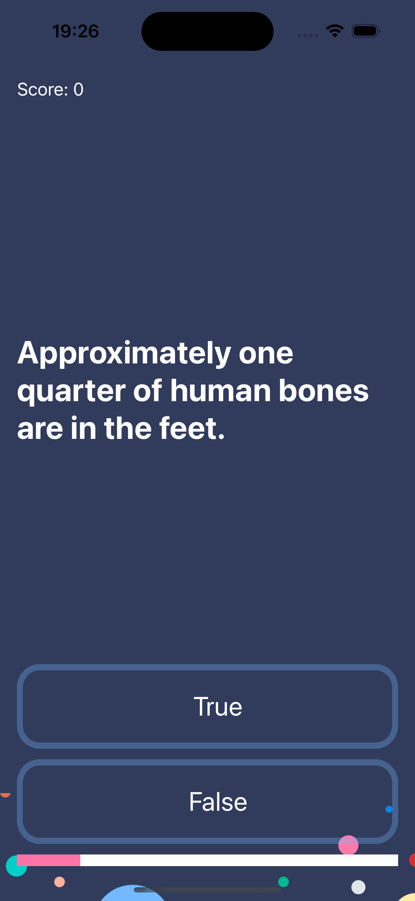

#  Quizzler

## My Goal

The goal of this app is to take one step further in my journey of becoming an app developer. I am going to practice the holy grail of mobile design patterns: the Model View Controller (MVC) pattern. A design pattern is simply a repeatable and optimised solution to a common software problem.

## What I created

I developed a trivia quiz app. That is multiple choice question apps are one of the most popular apps on the App Store! 

## What I learned

* How to programmatically change UI elements such as Labels and Buttons.
* What is a design pattern and how is it used in programming.
* How to use the Model-View-Controller or MVC pattern for app development.
* Learn about Swift Structures how to instantiate a struct instance.
* Understand the difference between value types and reference types. 
* Learn about Swift Classes and creating Objects.
* Compare Swift Classes with Swift Structs and know when to use which.
* Learn about Object Oriented Programming.
* How to refactor code and stay organised.

